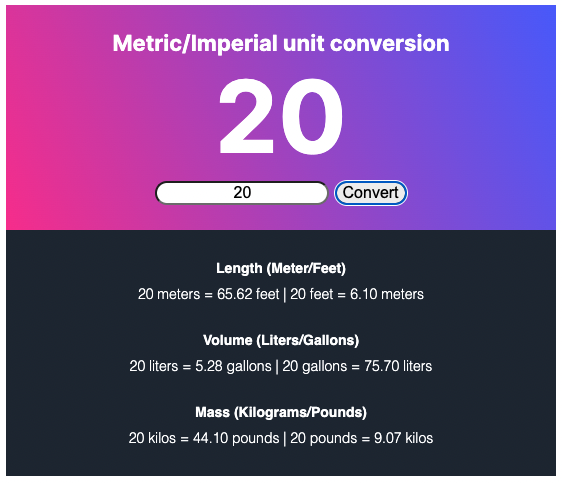

# Unit Converter

A solo project from the [Scrimba Frontend Developer Career Path](https://scrimba.com/learn/frontend)

## Table of Contents

- [Overview](#overview)
  - [Requirements](#requirements)
  - [Screenshots](#screenshots)
  - [Links](#links)
  - [Built with](#built-with)
- [Future Goals](#future-goals)

## Overview

### Requirements

- [x] Generate all conversions when the user clicks "Convert"
- [x] Round to 2 decimal places

### Screenshots

### Links

- Live Site URL: [GitHub Pages](https://xchristinawu.github.io/unit-converter/)

### Built with

- HTML, CSS, JavaScript

## Future Goals
- Implement mobile responsive web design
- Add up/down arrow for numbers

